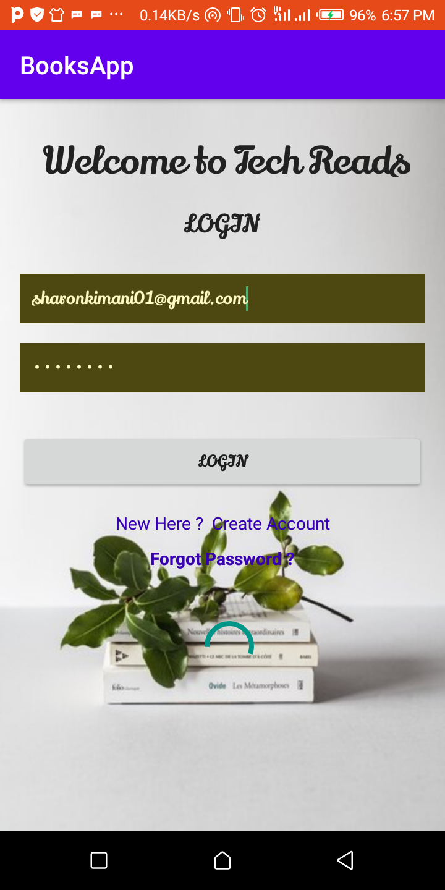
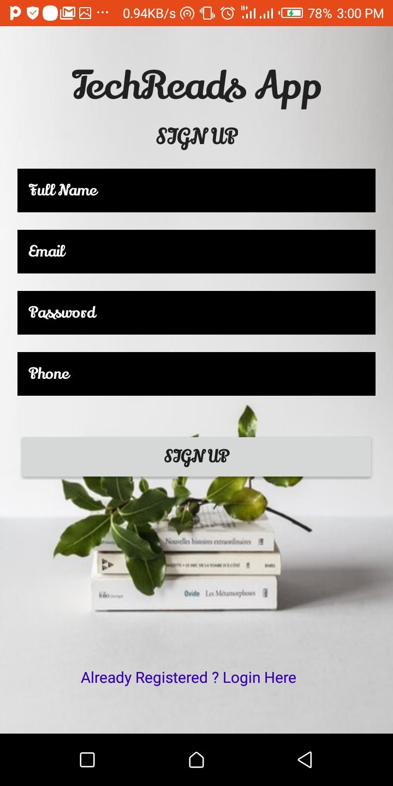
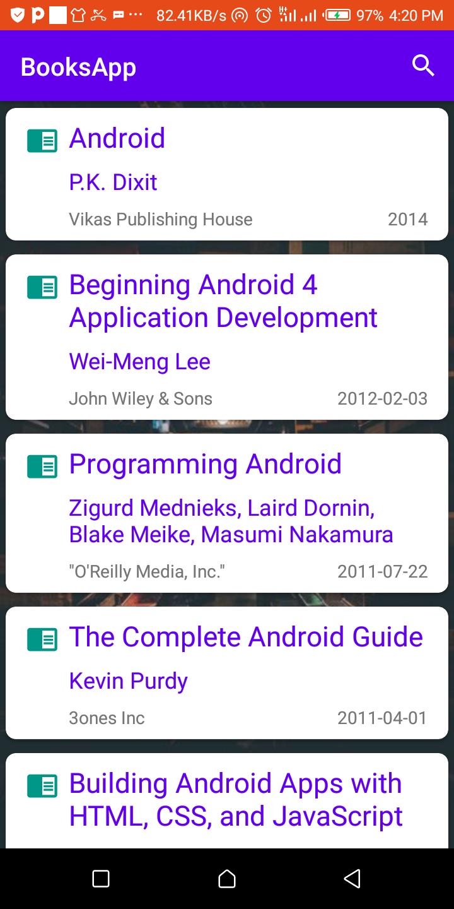
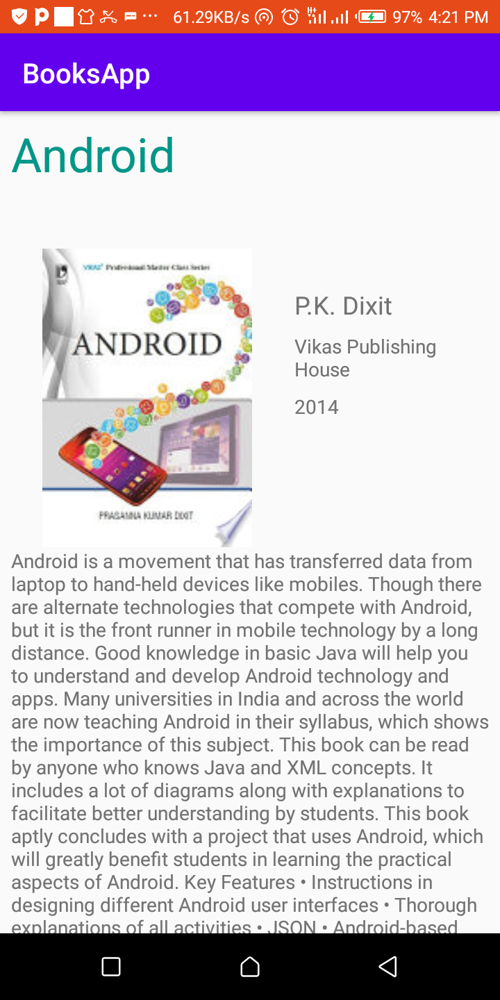
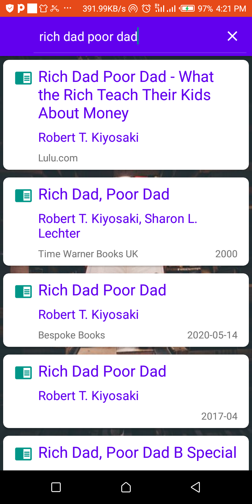
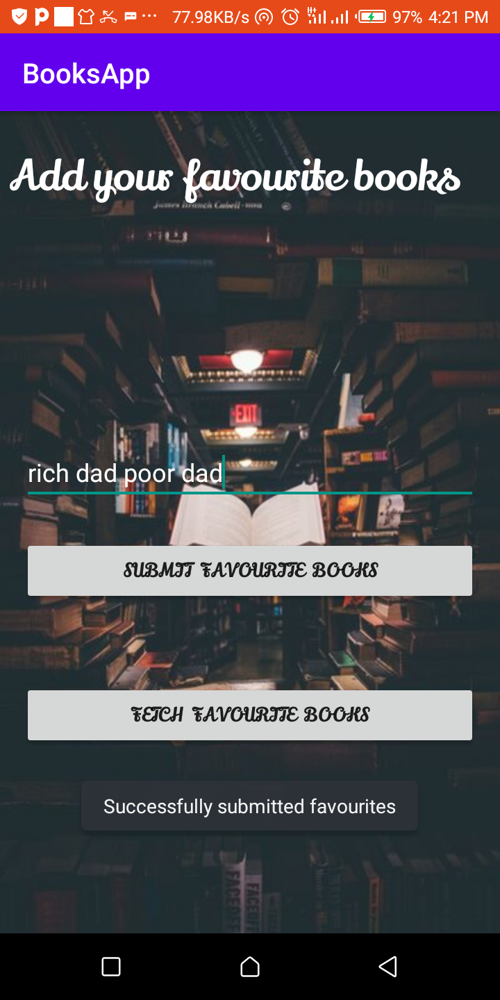

## Books-App
This is an application that allows users to search technology books,and read them online.

### Author
* Sharon Kimani

### Requirements
* Android Studio
* Java Development Kit
### Technologies Used
* Java
* ButterKnife
### BDD
User enters input,and clicks a search button then app returns a list of books related to the search.
## Demo

* A member user is prompt to login.

### Development
Want to contribute? Great!

To fix a bug or enhance an existing module, follow these steps:

*Fork the repo
*Create a new branch (git checkout -b improve-feature)
*Make the appropriate changes in the files
*Add changes to reflect the changes made
*Commit your changes (git commit -am 'Improve feature')
*Push to the branch (git push origin improve-feature)
*Create a Pull Request

### Setup/Installation Requirements
  *  To use this project, clone it "https://github.com/ShazzKimani/BOOKS-APP.git"
* Fire up Android Studio and make alterations however you want.
### Contact
* In case of anything reach via email at sharonkimani01@gmail.com

### License
* The MIT License (MIT)

Permission is hereby granted, free of charge, to any person obtaining a copy of this software and associated documentation files (the "Software"), to deal in the Software without restriction, including without limitation the rights to use, copy, modify, merge, publish, distribute, sublicense, and/or sell copies of the Software, and to permit persons to whom the Software is furnished to do so, subject to the following conditions:

The above copyright notice and this permission notice shall be included in all copies or substantial portions of the Software.

THE SOFTWARE IS PROVIDED "AS IS", WITHOUT WARRANTY OF ANY KIND, EXPRESS OR IMPLIED, INCLUDING BUT NOT LIMITED TO THE WARRANTIES OF MERCHANTABILITY, FITNESS FOR A PARTICULAR PURPOSE AND NONINFRINGEMENT. IN NO EVENT SHALL THE AUTHORS OR COPYRIGHT HOLDERS BE LIABLE FOR ANY CLAIM, DAMAGES OR OTHER LIABILITY, WHETHER IN AN ACTION OF CONTRACT, TORT OR OTHERWISE, ARISING FROM, OUT OF OR IN CONNECTION WITH THE SOFTWARE OR THE USE OR OTHER DEALINGS IN THE SOFTWARE.

Copyright (c) 2020 Sharon Kimani